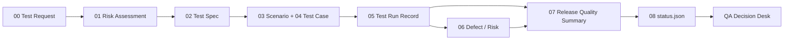

# QA Decision Desk

QA Decision Desk 把 repository、CI、manual check 與 release review 的結果整理成一個可追溯的發布判斷介面。每個 repo 只佔一列，先回答三個問題：能不能發、為什麼、證據在哪裡。

[Live Dashboard](https://sanyoii.github.io/test-status/) · [Test Cases 與執行記錄](https://sanyoii.github.io/test-status/run-records/) · [Fail 與 Log Demo](https://sanyoii.github.io/test-status/run-records/fail-demo/) · [Design Samples](https://sanyoii.github.io/test-status/dashboard-demo/) · [Source](https://github.com/sanyoii/RiskQADemoSite)

## Idea

測試結果常散在 CI logs、人工紀錄、issue、聊天與個人判斷裡。QA Decision Desk 把這些 evidence 接回同一個 release subject，讓讀者先看到 decision，再按需要展開 Gate Flow、Test Case、Run 與 Defect。

Dashboard 是 sanitized、read-only projection。Release Quality Summary 保留人工作出的判斷；Run Record 保存實際執行；Defect／Risk Log 保存 failure 與 disposition；`.test-dashboard/status.json` 負責 machine-readable projection。畫面不建立第二套真相來源。

## Decision flow



一次 release 的 evidence chain：

1. Test Request 鎖定 repository、release、full SHA、scope 與 decision question。
2. Risk Assessment 為每個 Product Area 設定 target coverage。
3. Test Spec 把風險轉成 automated、manual、exploratory、inspection 或 live checks。
4. Scenario 與 Test Case 定義使用者路徑、失敗路徑、資料與可觀察結果。
5. Run Record 追加保存每次 attempt。Fail、Blocked、retry 與後續 Pass 都留在 chronology。
6. Defect Report 記錄 failure、release impact、修正與 verification。
7. Release Quality Summary 由 QA owner、reviewer 與 decision owner 形成 recommendation。
8. Exporter 驗證 contract、freshness 與 public allowlist，產生 status snapshot。
9. Dashboard 讀取 snapshot；讀者可沿連結回到公開 evidence。

## Dashboard 怎麼讀

| Element | 回答的問題 | 來源 |
|---|---|---|
| Repository | 正在看哪個 release subject？ | repo、release／tag、branch、full SHA |
| Objective | 這次要支持什麼決策？ | Test Request／Test Spec |
| Release Decision | 現在能不能發布？ | human-owned Release Quality Summary |
| Test Effort | 這次投入多少種測試活動？ | Run inventory＋QA assessment |
| Coverage | 風險區域測到多深？ | Risk Assessment＋Coverage Inventory |
| Quality Assessment | 有哪些 warning、blocker 或 residual risk？ | Defect／Risk Log＋QA assessment |
| Gate Flow | Scope、execution、review、approval 到哪一步？ | G1、G3、G5、G6、Release receipts |
| Records | 判斷可否被重建？ | Test Cases、Run IDs、artifacts、public CI links |

Coverage 的 `0`、`1`、`1+`、`2`、`2+`、`3` 是測試深度，不是 code coverage 百分比。`Ready` 代表發布條件已由 decision owner 核准；缺陷、限制與 residual risk 仍要保留 disposition。`Unreachable` 表示最新 snapshot 取得失敗，產品狀態需要重新確認。

## 目前顯示的 repositories

| Repository | Objective | Decision | Effort | Coverage | Quality | Public evidence |
|---|---|---|---|---|---|---|
| `cex-market-data-quality-lab` | Release Readiness | Ready | High | Level 2+ | Ready | [Test Cases 與 Run Records](https://sanyoii.github.io/test-status/run-records/) |
| `sanyoii.github.io` | Deployment Confidence | Ready | Medium | Level 2+ | Healthy | [GitHub Actions run](https://github.com/sanyoii/sanyoii.github.io/actions/runs/32156748489) |

Fail Demo 使用 synthetic data，示範 Test Case Fail、release blocker、targeted rerun 與 No-Go 的呈現方式；它不屬於目前兩個 repository 的正式結果。

## 核心模板與放置位置

九個模板是 authoring library。實際套用時，把填好的文件複製進目標 repository，讓 evidence 跟著 release version 一起 review。Public README 只提供內容索引與 repo 落點；private QA vault 的本機位置不公開。

| Template | Canonical file | 套用後的 repository 位置 |
|---|---|---|
| [00 QA Test Request](#00-qa-test-request) | `Templates/QA/00-qa-test-request.md` | `docs/quality/<release>/quality-decision-brief.md` |
| [01 Quality Risk Assessment](#01-quality-risk-assessment) | `Templates/QA/01-quality-risk-assessment.md` | `docs/quality/<release>/risk-assessment.md` |
| [02 Test Spec](#02-test-spec) | `Templates/QA/02-test-spec.md` | `docs/quality/<release>/test-spec.md` |
| [03 Test Scenario](#03-test-scenario) | `Templates/QA/03-test-scenario.md` | `docs/quality/<release>/coverage-inventory.md` |
| [04 Test Case](#04-test-case) | `Templates/QA/04-test-case.md` | `docs/quality/<release>/test-cases.md` |
| [05 Test Run Record](#05-test-run-record) | `Templates/QA/05-test-run-record.md` | `test-records/<run-id>/run-record.md` |
| [06 Defect Report](#06-defect-report) | `Templates/QA/06-defect-report.md` | `docs/quality/<release>/defect-log.md` |
| [07 Release Quality Summary](#07-release-quality-summary) | `Templates/QA/07-release-quality-summary.md` | `docs/quality/<release>/release-quality-summary.md` |
| [08 Dashboard Status Contract](#08-dashboard-status-contract) | `Templates/QA/08-dashboard-status-contract.md` | `.test-dashboard/status.json` |

九份模板不等於每次 release 都要產生九份文件。`QA-Lite` 可以把 request、risk、coverage 與 decision 收在同一份短文件；Test Run Record 與 Release Quality Summary 每次執行都要保留。`QA-Standard`、`QA-High-Risk` 與命中 hard trigger 的範圍，再加入詳細 case 或 conditional templates。

### 00 QA Test Request

鎖定 requester、release subject、business objective、scope、known risks、限制與要支持的 release question。資訊不足時維持 `needs-information`。

### 01 Quality Risk Assessment

逐一列出 Product Area、failure mode、impact、uncertainty、recoverability、existing controls、target coverage、residual risk 與 owner。Unknown 不會被默認成 Low。

### 02 Test Spec

定義 tested scope、test types、entry／suspension／exit criteria、環境、test data、execution method、artifact、retention、review 與 limitations。

### 03 Test Scenario

以使用者或業務路徑描述 start state、trigger、happy／negative paths、expected outcome 與 risk traceability，不塞入 click-by-click steps。

### 04 Test Case

保存 preconditions、concrete data、連續步驟、observable expected result、cleanup、variants、actual result、Run ID、Defect ID 與 evidence links。

### 05 Test Run Record

Append-only 保存 full SHA、worktree、environment、exact command／procedure、每次 attempt、exit code、case results、artifact hash、retention 與 final run state。

### 06 Defect Report

把 failure 接到 requirement、risk、scenario、case 與 run；清楚區分 suspected cause、confirmed cause、Fixed 與 Verified。

### 07 Release Quality Summary

整理 coverage target／actual、run inventory、open defects、accepted risks、waivers、limitations 與 recommendation，再由 decision owner記錄 Go、No-Go 或 Hold。

### 08 Dashboard Status Contract

約束 `.test-dashboard/status.json` 的 versions、subject、assessment、timestamps、Data Status、evidence links 與 public disclosure。Schema invalid、evidence stale 或 authority 不符時 fail closed。

## Source of truth and public boundary

| Layer | 保存內容 | 規則 |
|---|---|---|
| QA template library | 可重用的空白模板 | 只定義欄位與流程，不代表已執行 |
| Repository evidence | release-specific docs、run records、machine results、artifacts | 綁定 full SHA、environment、scope 與 chronology |
| Status contract | approved assessment 的 machine-readable projection | validator 不猜缺值；failure 保留 last-known-good 並標示 Stale／Invalid／Unreachable |
| Public Dashboard | 支持決策所需的 sanitized snapshot | 只顯示 allowlist fields 與可公開 links |

Public surface 不包含 raw logs、protected receipts、credentials、test accounts、PII、local paths、private URLs、敏感 test data 或未消毒的 defect details。

## Repository map

- [正式 Dashboard](app/page.tsx)
- [Repository data 與 Gate Flow](app/dashboard-demo/_template-parts.tsx)
- [Test Cases 與 Run Records](app/run-records/page.tsx)
- [Synthetic Fail Demo](app/run-records/fail-demo/page.tsx)
- [Rendered route tests](tests/rendered-html.test.mjs)
- [Continuity handoff](handoff/2026-08-18-repo-based-low-tech-testing-dashboard.md)

## Local development

Requires Node.js `>=22.13.0`.

```bash
npm ci
npm run dev
npm test
npm run lint
```

`npm test` 會先 build，再驗證正式 Dashboard、Run Records、Fail Demo、Design Samples、public disclosure boundary、metadata 與 starter-only files 的移除狀態。
