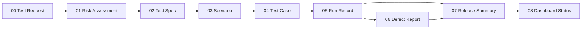

# QA 核心模板

這九份檔案是 QA Decision Desk 的 canonical authoring library。套用到 release 時，把填好的文件複製進該 repository，跟著 release version review；不要直接引用這裡的檔案，避免歷史 evidence 隨模板更新。

## Decision flow

## Template index

| No. | Template | Use | Suggested repository copy |
|---|---|---|---|
| 00 | [QA Test Request](00-qa-test-request.md) | 鎖定 subject、scope 與 decision question | `docs/quality/<release>/quality-decision-brief.md` |
| 01 | [Quality Risk Assessment](01-quality-risk-assessment.md) | 決定風險與 target coverage | `docs/quality/<release>/risk-assessment.md` |
| 02 | [Test Spec](02-test-spec.md) | 定義 approach、gates 與 evidence | `docs/quality/<release>/test-spec.md` |
| 03 | [Test Scenario](03-test-scenario.md) | 描述業務流程與正負向 coverage | `docs/quality/<release>/coverage-inventory.md` |
| 04 | [Test Case](04-test-case.md) | 保存可重現的 test procedure | `docs/quality/<release>/test-cases.md` |
| 05 | [Test Run Record](05-test-run-record.md) | Append-only 保存每次執行 | `test-records/<run-id>/run-record.md` |
| 06 | [Defect Report](06-defect-report.md) | 連結 failure、impact 與 verification | `docs/quality/<release>/defect-log.md` |
| 07 | [Release Quality Summary](07-release-quality-summary.md) | 形成 human-owned release recommendation | `docs/quality/<release>/release-quality-summary.md` |
| 08 | [Dashboard Status Contract](08-dashboard-status-contract.md) | 約束 `.test-dashboard/status.json` projection | `.test-dashboard/status.json` |

九份模板是 library，不代表每次 release 都要建立九份文件。依 `QA-Lite`、`QA-Standard`、`QA-High-Risk` 與 conditional triggers 決定所需組合；Test Run Record 與 Release Quality Summary 每次 release 都不能省略。

## Shared rules

- 所有 evidence 都要綁定 repository、release、branch、full SHA、environment、scope、owner 與 timestamps。
- `Fail`、`Blocked`、retry 與後續 `Pass` 全部保留，不能覆寫 chronology。
- Product Test Status 和 Data Status 分開判定。
- `Ready` 需要 human-owned release assessment；測試全綠不會自動產生 Ready。
- 公開前執行 allowlist projection、secret／PII scan、link review 與 post-publish smoke。
