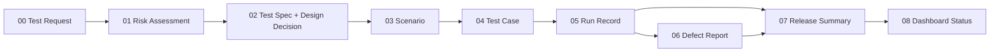

# QA 核心模板

這九份檔案是 QA Decision Desk 的 canonical authoring library。套用到 release 時，把填好的文件複製進該 repository，跟著 release version review；不要直接引用這裡的檔案，避免歷史 evidence 隨模板更新。

## Decision flow



## Template index

| No. | Template | Use | Suggested repository copy |
|---|---|---|---|
| 00 | [QA Test Request](00-qa-test-request.md) | 鎖定 subject、scope 與 decision question | `docs/quality/<release>/quality-decision-brief.md` |
| 01 | [Quality Risk Assessment](01-quality-risk-assessment.md) | 決定風險與 target coverage | `docs/quality/<release>/risk-assessment.md` |
| 02 | [Test Spec](02-test-spec.md) | 定義 approach、test design decision、gates 與 evidence | `docs/quality/<release>/test-spec.md` |
| 03 | [Test Scenario](03-test-scenario.md) | 描述業務流程與正負向 coverage | `docs/quality/<release>/coverage-inventory.md` |
| 04 | [Test Case](04-test-case.md) | 保存可重現的 test procedure | `docs/quality/<release>/test-cases.md` |
| 05 | [Test Run Record](05-test-run-record.md) | Append-only 保存每次執行 | `test-records/<run-id>/run-record.md` |
| 06 | [Defect Report](06-defect-report.md) | 連結 failure、impact 與 verification | `docs/quality/<release>/defect-log.md` |
| 07 | [Release Quality Summary](07-release-quality-summary.md) | 形成 human-owned release recommendation | `docs/quality/<release>/release-quality-summary.md` |
| 08 | [Dashboard Status Contract](08-dashboard-status-contract.md) | 約束 `.test-dashboard/status.json` projection | `.test-dashboard/status.json` |

九份模板是 library，不代表每次 release 都要建立九份文件。依 `QA-Lite`、`QA-Standard`、`QA-High-Risk` 與 conditional triggers 決定所需組合；Test Run Record 與 Release Quality Summary 每次 release 都不能省略。

Test Design Decision 直接放在 02 Test Spec，**不新增第十個核心模板**。它保存這條可審查鏈：

```text
Risk → Failure mode → Method → Oracle → Execution evidence → Decision
```

選擇 Method 時同時考慮 risk、規格特徵與 observability／environment constraint。Expected result 優先引用 approved requirement、business rule、API／schema contract 或 reviewed domain decision；只有 current behavior 時標為 characterization evidence，無核准來源時誠實標 `Assumption`，來源衝突或需求未定義時標 `Unknown／needs-clarification`。

## Playbook advisory layer

### 填好之後怎麼驗證

QA-Lite 只維護三份 release-specific 記錄：**brief/design、run ledger、decision**。Requirement、Risk、Design、Case 使用穩定 ID；machine packet 引用這三份，不新增另一套審批真相。

依 [執行契約](../../docs/decision-workflow.md) 填入 `release-evidence.json`，執行 `npm run review:release -- <packet> --design-only` 檢查設計；實際測試 artifact 與人工 review 齊全後，才執行不含 `--design-only` 的 review 和 `npm run gate:release`。Template heading test 只驗模板，不能代替 filled-packet review。

未解決的必要 oracle、缺少 required case、過期 live/manual run、artifact 雜湊不符與已改變的審查 input 都不得變成 Ready。後續 Pass 追加到台帳；使用 `--previous` 核對不能被刪改的先前 attempts/events。

[`Playbooks/QA`](../../Playbooks/QA/README.md) 提供 requirement readiness、coverage analysis、regression selection、test data、API coverage、defect triage 與 RCA 的 reviewable workflow。Playbook 不是第十個核心模板，也不是 evidence source；reviewed findings 仍要落回上表的 release-specific artifacts。

Coverage Analysis 沿用 03 Test Scenario contract，把完整 Requirement／AC → Scenario → Case → Run matrix 寫到 `docs/quality/<release>/coverage-inventory.md`。07 Release Quality Summary 只保留 target vs actual、重要 gaps、residual risk 與 inventory link，不複製完整矩陣。

## Shared rules

- 所有 evidence 都要綁定 repository、release、branch、full SHA、environment、scope、owner 與 timestamps。
- `Fail`、`Blocked`、retry 與後續 `Pass` 全部保留，不能覆寫 chronology。
- Product Test Status 和 Data Status 分開判定。
- `Ready` 需要 human-owned release assessment；測試全綠不會自動產生 Ready。
- 公開前執行 allowlist projection、secret／PII scan、link review 與 post-publish smoke。
